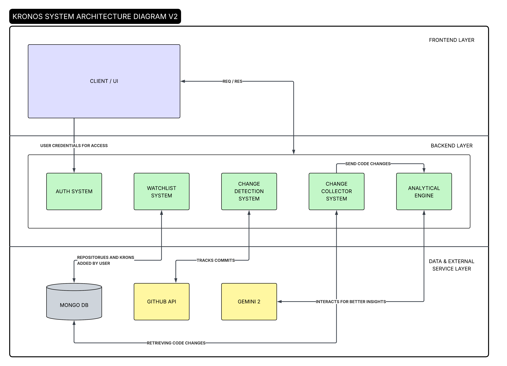

<!-- navbar -->
<p align="center">
  <a href="#overview">Overview</a> •
  <a href="#why-kronos">Why Kronos</a> •
  <a href="#architecture">Architecture</a> •
  <a href="#whats-implemented">What's Implemented</a> •
  <a href="#whats-next">What's Next</a> •
  <a href="#tech-stack">Tech Stack</a> •
  <a href="#installation">Installation</a> •
  <a href="#contributing">Contributing</a> •
  <a href="#license">License</a>
</p>

<!-- header -->
<p align="center">
  
</p>

<h1 align="center">Kronos — Developer Productivity Guardian</h1>

<p align="center">
  <a href="https://creativecommons.org/licenses/by-nc/4.0/">
    
  </a>
  
  
</p>

---

## Overview

Kronos is a modular-monolith web application that functions as a developer productivity guardian for GitHub. It monitors repositories that users explicitly opt into tracking — called **Krons** — collects activity metrics via webhooks & scheduled tasks, and leverages an LLM to generate insights and visualizations. Kronos helps developers spot patterns, identify bottlenecks, and understand how they actually code over time.

---

## Why Kronos ?

In the age of AI, it is easy for developers to hop between side projects endlessly — starting fast, losing momentum, and never understanding why. Kronos is built around two ideas:

**Intentionality** — you choose which projects you track. Adding a Kron is a deliberate act: this is a project I am serious about.

**Self-awareness** — over time, Kronos builds a picture of how you code. When do you ship? Where do you slow down? What modules do you keep touching? The data already exists in your commits. Kronos surfaces it.

---

## Architecture

Kronos is organized into three layers:


 


### How It Works — Request Flow

1. **Login** — GitHub OAuth2 authenticates the user. Users repo email is scoped and stored. Refresh tokens are stored in Redis with a TTL and mirrored in MongoDB.

2. **Add a Kron** — When a user adds a repository as a Kron, two things happen atomically: a webhook is registered on GitHub pointing to Kronos, and a reference is stored in MongoDB. No Kron without a webhook. No webhook without a Kron.

3. **Push event fires** — GitHub sends a signed webhook payload to Kronos. The Change Detection system verifies the HMAC-SHA256 signature, then enriches the raw commit data with file-level diffs via the GitHub API — data that GitHub's webhook payload omits by design.

4. **Change Collection** — A cron job (every 4 hours) harvests the enriched commit data and forwards it to the Analytical Engine.

5. **Analytical Engine** — Processes the commit data, sends it to Gemini 2 for AI-generated insights, and persists the analysis result to MongoDB with a timestamp.

6. **Notifications** — Users receive periodic summaries and post-analysis alerts when insights are ready.

### Key Engineering Decisions

| Decision | Rationale |
|---|---|
| Redis for repo list caching + ETag invalidation | Avoid hammering GitHub API on every request |
| MongoDB virtuals + populate for Kron references | Store references, not snapshots — avoids data duplication |
| Transactional Change-Detection System (Kron + webhook registration) | Prevent orphaned webhooks or Krons with no watcher |
| HMAC-SHA256 webhook signature verification | Reject spoofed payloads before any processing |
| Constant-time signature comparison | Prevent timing attacks on webhook verification |
| Raw body preservation for webhook route | `express.json()` destroys bytes needed for HMAC verification |
| Transient storing for commit data | Raw diffs are not worth persisting — only the analysis result survives |
| Cron-based Change Collection | Decouples event ingestion from processing |

---

## What's Implemented

### 1 Authentication System
 
- GitHub OAuth2 sign-in and sign-up flow
- Refresh tokens stored in Redis (with TTL), MongoDB, and as a client-side cookie
- Dedicated `/validate-token` route — checks if access token (JWT) is still valid; if not, checks the refresh token from the cookie against Redis and MongoDB before deciding to revoke or renew
- Redis TTL as the source of truth for session expiry — when the TTL expires, the cookie becomes meaningless and access is revoked entirely
- Access token stored in Redux state on the frontend — protected routes check Redux state, only public routes are accessible without it
- Axios interceptor auto-regenerates access tokens silently assisted by a failed request queue — concurrent requests that fail while a refresh is in progress are queued and retried, not lost
- Protected and public routes with loading states

### 2 Watchlist System
 
- Full CRUD for repository list and Kron list
- Repo list fetched from GitHub, cached in Redis, and invalidated using GitHub's ETag header — no unnecessary API calls
- Kron references stored in MongoDB using virtuals and `populate` — stores references to repos, not snapshots, avoiding data duplication
 

### 3 Change Detection System
 

- Transactional Kron registration: when a user adds a Kron, a GitHub webhook is registered and a MongoDB reference is created atomically — if either fails, both are rolled back. No orphaned webhooks. No Krons without a watcher.
- Same transactional guarantee on deletion — webhook is removed from GitHub and MongoDB reference is cleaned up programmatically
- Raw body preservation: a custom `verify` callback on `express.json()` saves the raw request buffer to `req.rawBody` specifically for the webhook route — before Express parsing destroys the bytes needed for HMAC verification
- Webhook signature verification middleware: reads `X-Hub-Signature-256` from the GitHub request header, computes an HMAC-SHA256 hash of the raw body using `WEBHOOK_SECRET`, does a length check, then uses `crypto.timingSafeEqual()` for constant-time comparison — preventing both spoofed payloads and timing attacks
- Commit data enrichment via secondary GitHub API call (`getRicherCommitData`) — GitHub's webhook payload omits file-level diff data by design; Kronos fetches it explicitly via Octokit, adding `filename`, `additions`, `deletions`, and `changes` per file
- Enriched commit data held in memory (transient) — Change Collection picks it up from here for processing
---

## What's Next

### 1 Change Collection System
- Cron job (every 6 hours) harvests enriched commit data
- Forwards to Analytical Engine for processing
- End-of-day and midday summary collection windows

### 2 Analytical Engine
- Diff analysis: files changed, lines added/removed, commit patterns, module focus
- Gemini 2 integration for AI-generated text insights
- Analysis results persisted to MongoDB with timestamps

### 3 Notification System
- Post-analysis alerts when insights are ready
- Periodic summaries (daily rollup + midday sprint summary)

### 4 Visualizations
- Interactive charts for activity trends, module focus, coding patterns

---

## Tech Stack


<!-- Backend -->
  <!-- Backend Frameworks -->
  
  
  
  


  <!-- Frontend awareness -->
  <!-- API / Web -->
  
  
  
  
  
  

| Layer | Technology | Why |
|---|---|---|
| Frontend | React + TypeScript + Vite | Fast dev experience, type safety |
| Backend | Node.js + Express | Event-driven, fits webhook architecture |
| Database | MongoDB | Flexible schema for evolving commit data structures |
| Cache / Queue | Redis | Repo list caching, refresh token storage
| Auth | GitHub OAuth2 | Users already live on GitHub — zero friction login |
| Enrichment | Octokit (GitHub API) | File-level diff data not included in webhook payloads |
| AI | Gemini 2 | LLM for generating productivity insights from preprocessed commit data |

---

## Installation

### 1. Clone the repository
```bash
git clone https://github.com/theChibuikem/kronos.git
cd kronos
```

### 2. Install dependencies

```bash
# Backend
cd backend
npm install

# Frontend
cd ../frontend
npm install
```

### 3. Set up MongoDB Atlas

- Create a free cluster at [MongoDB Atlas](https://www.mongodb.com/cloud/atlas)
- Create a database named `kronos`
- Copy your connection string

### 4. Configure environment variables

**Backend `.env`**
```ini
# ========================
# APP ENVIRONMENT
# ========================
MODE=local

# ========================
# DATABASE
# ========================
MONGO_URI=your_mongoDB_uri

# ========================
# AUTH / TOKENS
# ========================
ACCESS_TOKEN_SECRET=some_random_string
REFRESH_TOKEN_SECRET=some_random_string

# ========================
# GITHUB INTEGRATION
# ========================
GITHUB_CLIENT_ID=your_github_client_id
GITHUB_CLIENT_SECRET=your_github_client_secret
WEBHOOK_SECRET=some_random_string

# ========================
# REDIS (CACHING / QUEUE)
# ========================
REDIS_HOST=your_redis_host
REDIS_PORT=your_redis_port
REDIS_PASSWORD=your_redis_password

# ========================
# URL CONFIGURATION
# ========================
# Backend
LOCAL_BACKEND_URL=http://localhost:5000
REMOTE_BACKEND_URL=https://kronos-dev.onrender.com

# Frontend
LOCAL_FRONTEND_URL=http://localhost:5173
REMOTE_FRONTEND_URL=https://kronos-fe.onrender.com
```

**Frontend `.env`**
```ini
VITE_MODE=local
VITE_LOCAL_BACKEND_URL=http://localhost:5000
VITE_REMOTE_BACKEND_URL=https://kronos-dev.onrender.com
VITE_LOCAL_FRONTEND_URL=http://localhost:5173
VITE_REMOTE_FRONTEND_URL=https://kronos.com
```

> Generate some random string with:
> ```bash
> node -e "console.log(require('crypto').randomBytes(32).toString('hex'))"
> ```

### 5. Run the project

```bash
# Backend
cd backend
npm start

# Frontend
cd frontend
npm run dev
```

### 6. Open in browser

Visit `http://localhost:5173`

> Make sure your GitHub OAuth app callback URL is configured correctly. See [GitHub's OAuth docs](https://docs.github.com/en/apps/oauth-apps/building-oauth-apps/authorizing-oauth-apps).

---

## Contributing

Contributions are not open yet — but they will be soon. If you're interested in contributing, watch the repo and stay tuned.

---

## License

This project is licensed under the [CC BY-NC 4.0](https://creativecommons.org/licenses/by-nc/4.0/) License.

---

## Demo

**Coming soon.**

---

<p align="center">Built by <a href="https://www.linkedin.com/in/david-chukwuemeka-870724289/">David Chukwuemeka</a></p>