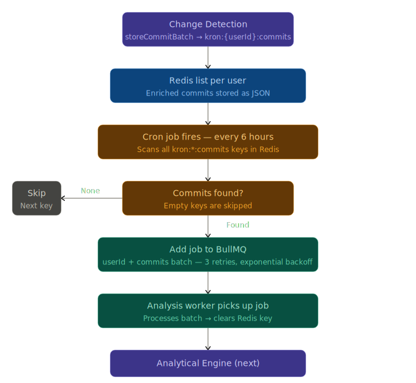

# Kronos — Backend

This is the backend service for **Kronos**, a developer productivity guardian for GitHub. It handles authentication, webhook ingestion, change detection, and job processing for repositories users opt into tracking ("Krons").

> See the [root README](../README.md) for full project context, architecture diagrams, and frontend setup.

---

## What's Implemented

### 1. Authentication System

- GitHub OAuth2 sign-in and sign-up flow
- Refresh tokens stored in Redis (with TTL), MongoDB, and as a client-side cookie
- Dedicated `/validate-token` route — checks if the access token (JWT) is still valid; if not, checks the refresh token from the cookie against Redis and MongoDB before deciding to revoke or renew
- Redis TTL as the source of truth for session expiry — when the TTL expires, the cookie becomes meaningless and access is revoked entirely
- Axios interceptor auto-regenerates access tokens silently, assisted by a failed request queue — concurrent requests that fail while a refresh is in progress are queued and retried, not lost

### 2. Watchlist System

- Full CRUD for repository list and Kron list
- Repo list fetched from GitHub, cached in Redis, and invalidated using GitHub's ETag header — no unnecessary API calls
- Kron references stored in MongoDB using virtuals and `populate` — stores references to repos, not snapshots, avoiding data duplication

### 3. Change Detection System

- Transactional Kron registration: when a user adds a Kron, a GitHub webhook is registered and a MongoDB reference is created atomically — if either fails, both are rolled back. No orphaned webhooks. No Krons without a watcher.
- Same transactional guarantee on deletion — webhook is removed from GitHub and MongoDB reference is cleaned up programmatically
- Raw body preservation: a custom `verify` callback on `express.json()` saves the raw request buffer to `req.rawBody` for the webhook route — before Express parsing destroys the bytes needed for HMAC verification
- Webhook signature verification middleware: reads `X-Hub-Signature-256` from the GitHub request header, computes an HMAC-SHA256 hash of the raw body using `WEBHOOK_SECRET`, does a length check, then uses `crypto.timingSafeEqual()` for constant-time comparison — preventing both spoofed payloads and timing attacks
- Commit data enrichment via a secondary GitHub API call (`getRicherCommitData`) — GitHub's webhook payload omits file-level diff data by design; Kronos fetches it explicitly via Octokit, adding `filename`, `additions`, `deletions`, and `changes` per file
- Enriched commit data held in memory (transient) — Change Collection picks it up from here for processing

### 4. Change Collection System

- `storeCommitBatch` stores enriched commits per user in Redis under `kron:{userId}:commits` as a JSON list
- Cron job runs every 6 hours (`0 */6 * * *`), scans all `kron:*:commits` keys, skips empty keys, and batches commits per user
- Jobs pushed to BullMQ (`analysis-queue`) with 3 retry attempts and exponential backoff starting at 2 seconds
- BullMQ Worker picks up each job, processes the commit batch, and clears the Redis key after completion
- Failed jobs retained in BullMQ for inspection — not silently dropped
- Analytical Engine integration stubbed and ready — `analyzeWithGemini` and `saveInsights` calls are next

---

## Key Engineering Decisions

| Decision | Rationale |
|---|---|
| Redis for repo list caching + ETag invalidation | Avoid hammering GitHub API on every request |
| MongoDB virtuals + populate for Kron references | Store references, not snapshots — avoids data duplication |
| Transactional Change-Detection System (Kron + webhook registration) | Prevent orphaned webhooks or Krons with no watcher |
| HMAC-SHA256 webhook signature verification | Reject spoofed payloads before any processing |
| Constant-time signature comparison | Prevent timing attacks on webhook verification |
| Raw body preservation for webhook route | `express.json()` destroys bytes needed for HMAC verification |
| Transient storing for commit data | Raw diffs are not worth persisting — only the analysis result survives |
| Cron-based Change Collection | Decouples event ingestion from processing |

---

## Tech Stack

| Technology | Why |
|---|---|
| Node.js + Express | Event-driven, fits webhook architecture |
| MongoDB | Flexible schema for evolving commit data structures |
| Redis | Repo list caching, refresh token storage, transient commit data |
| BullMQ | Reliable job processing with retries, exponential backoff, and worker management |
| GitHub OAuth2 | Users already live on GitHub — zero friction login |
| Octokit (GitHub API) | File-level diff data not included in webhook payloads |
| Gemini 2 | LLM for generating productivity insights from preprocessed commit data |

---

## Setup

### 1. Install dependencies

```bash
cd backend
npm install
```

### 2. Set up MongoDB Atlas

- Create a free cluster at [MongoDB Atlas](https://www.mongodb.com/cloud/atlas)
- Create a database named `kronos`
- Copy your connection string

### 3. Configure environment variables

Create a `.env` file in this directory:

```ini
# ========================
# APP ENVIRONMENT
# ========================
MODE=local

# ========================
# DATABASE
# ========================
MONGO_URI=your_mongoDB_uri

# ========================
# AUTH / TOKENS
# ========================
ACCESS_TOKEN_SECRET=some_random_string
REFRESH_TOKEN_SECRET=some_random_string

# ========================
# GITHUB INTEGRATION
# ========================
GITHUB_CLIENT_ID=your_github_client_id
GITHUB_CLIENT_SECRET=your_github_client_secret
WEBHOOK_SECRET=some_random_string

# ========================
# REDIS (CACHING / QUEUE)
# ========================
REDIS_HOST=your_redis_host
REDIS_PORT=your_redis_port
REDIS_PASSWORD=your_redis_password

# ========================
# URL CONFIGURATION
# ========================
LOCAL_BACKEND_URL=http://localhost:5000
REMOTE_BACKEND_URL=https://kronos-dev.onrender.com
LOCAL_FRONTEND_URL=http://localhost:5173
REMOTE_FRONTEND_URL=https://kronos-fe.onrender.com
```

> Generate a random secret with:
> ```bash
> node -e "console.log(require('crypto').randomBytes(32).toString('hex'))"
> ```

### 4. Run the server

```bash
npm start
```

Server runs at `http://localhost:5000` by default.

---

## License

This project is licensed under the [CC BY-NC 4.0](https://creativecommons.org/licenses/by-nc/4.0/) License.