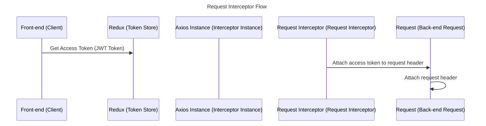
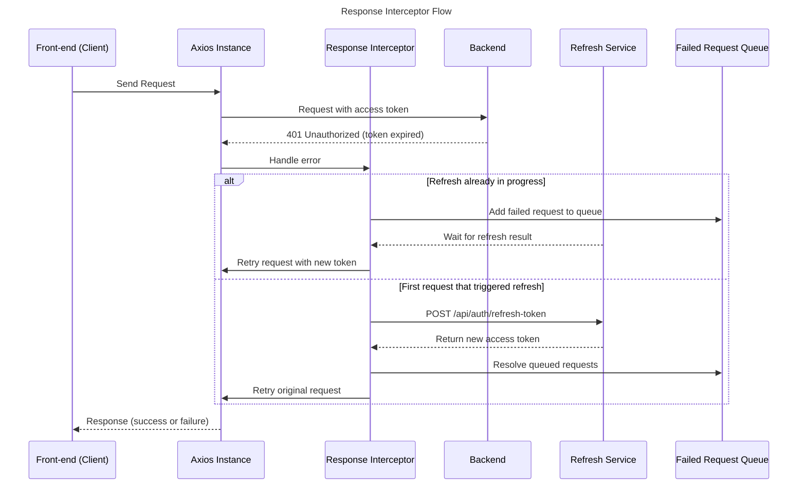

> Part of Kronos -> Developer Productivity Guardian


## About

<br>
The axios interceptor automatically watches any request made from or response sent to any axios instance, and modifies it on failure in oreder to meet the requirements for success.

<br>

## Requirements

- Axios instance
- Request Interceptor
- Response Interceptor

<br>

## Axios Instance

Creating axios instance

```tsx
const api = axios.create({
  baseURL: "http://localhost:5000",
  withCredentials: true,
})// Create a single axios instance. This prevents repeating config everywhere.
```

<br>

### Interceptor Dependencies

Creating other dependencies for interceptors

- Refreshing flag - To keep track of when a request is refreshing

```tsx

let isRefreshing = false // This flag prevents multiple refresh-token calls from firing at the same time.
```

- Failed Queue - To keep track of failed requests

```tsx

let failedQueue: any[] = []// When multiple requests fail with 401 while refresh is ongoing, we store them.
```

- Process Queue - To handle requests in failed queue

```tsx
const processQueue = (error: any, token: string | null = null) => {
  // Loop through all queued promises and resolve/reject them depending on refresh result.
  failedQueue.forEach(prom => {
    if (error) prom.reject(error);// If refresh failed, reject all waiting requests.
    else prom.resolve(token)// If refresh succeeded, give them the new token.
  });
  failedQueue = []; //Clear
}//handle waiting requests
```
<br>
<br>

## Request Interceptor

```markdown


```

```tsx
api.interceptors.request.use(
  (config) => {
    // Pull the latest access-token from Redux.
    const state = store.getState();
    const token = state.authenticated.isAuthenticated;

    // setting access token in request headers
    if (token) config.headers.Authorization = `Bearer ${token}`;

    return config;
  },
  (error) => Promise.reject(error)
);
```

<br>
<br>


## Response Interceptor

The response interceptor handles backend errors, detects expired access tokens, refreshes them using the refresh-token cookie, retries failed requests, and manages a queue of waiting requests so only one refresh is triggered at a time.

<br>

## Flow Diagram



<br>

## Response Interceptor Code (with commentary)

```tsx
// ====================== RESPONSE INTERCEPTOR ======================
api.interceptors.response.use(
  (response) => response, // Success → return normally.

  async (error) => {
    const originalRequest = error.config; // Save failed request for retry.

    // Only run refresh logic on 401 and if request hasn't retried yet.
    if (error.response?.status === 401 && !originalRequest._retry) {

      // If another refresh call is already running:
      if (isRefreshing) {
        // Add this request to the queue and wait.
        return new Promise((resolve, reject) => {
          failedQueue.push({ resolve, reject });
        })
          .then((token) => {
            // Retry after refresh completes.
            originalRequest.headers.Authorization = "Bearer " + token;
            return api(originalRequest);
          })
          .catch((err) => Promise.reject(err));
      }

      // Start a new refresh process.
      originalRequest._retry = true;
      isRefreshing = true;

      try {
        // Request new access token from backend.
        const res = await axios.post(
          "http://localhost:5000/api/auth/refresh-token",
          {},
          { withCredentials: true }
        );

        const newAccessToken = res.data.accessToken;

        // Save updated token to Redux so future requests use it automatically.
        store.dispatch(setAuthenticated(newAccessToken));

        // Resolve queued requests with the fresh token.
        processQueue(null, newAccessToken);
        isRefreshing = false;

        // Retry the original request that triggered refresh.
        originalRequest.headers.Authorization = `Bearer ${newAccessToken}`;
        return api(originalRequest);

      } catch (refreshError) {
        // Refresh failed → reject all queued requests.
        processQueue(refreshError, null);
        isRefreshing = false;
        return Promise.reject(refreshError);
      }
    }

    // Not a 401 → normal error.
    return Promise.reject(error);
  }
);

```

<br>

## How It Works

- Successful responses are returned immediately.
- A 401 triggers token-refresh logic.
- If refresh already running → failed requests are stored in `failedQueue`.
- When refresh completes:
    - All queued requests are resolved with the new token.
    - Original request is retried.
- If refresh fails:
    - All queued requests are rejected.
    - User must log in again.

<br>