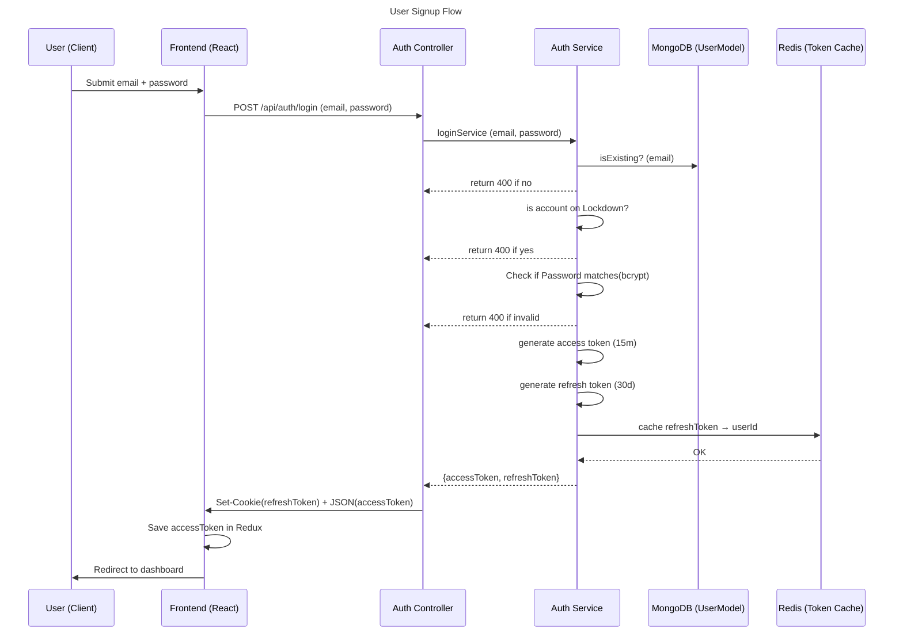

> Part of Kronos -> Developer Productivity Guardian

# Login
This page explains the entire login flow for Kronos.

<br>
 
## Flow Diagram
<br>





<br>
<br>


# Backend

<br>

## Auth Controller
<br>

Get email and password from http request and use them in authService

```jsx
  const { email, password } = req.body;

  const result = await logInService(email, password); //response from login service
```
<br>


# Auth Service
<br>
Checking if this user actually exists in the DB

```jsx
    const existingUser = await userModel.findOne({ userEmail: email }); // finds user

    // if email doesn't match any existing user
    if (!existingUser) {
      return {
        status: 404,
        data: { error: "Invalid login credentials" },
      };
    }
```

If User exists, check if account is on lockdown

```jsx
    // if my account is locked down
    if (existingUser && existingUser.lockUntil > Date.now()) {
      return {
        status: 400,
        data: {
          error: "account locked temporarily, try again in 30 mminutes",
        }, //flag for front-end
      };
    }
```

Check if password input matches using bcrypt

```jsx
    //if we pass our existing-user guard
    const match = await checkUser(password, existingUser.userPassword);

    //operation on password mismatch
    if (!match) {
      existingUser.failedAttempts++;} //increments failed attempts
```

Sign refresh and access token for authorization

```jsx
//short term token
    const accessToken = jwt.sign(
      { userId: existingUser["_id"], roles: existingUser["roles"] },
      process.env.ACCESS_TOKEN_SECRET,
      { expiresIn: "15m" }
    ); //access-token

    //long term token
    const refreshToken = jwt.sign(
      { userId: existingUser["_id"] },
      process.env.REFRESH_TOKEN_SECRET,
      {
        expiresIn: "30d",
      }
    ); //refresh Token
```

Caching refresh Token in redis and saving user, we use the refreshToken as the key so that we can target it later on using refresh cookie

```jsx
    redisClient.set(refreshToken,`refresh:${existingUser["_id"]}`, {
      EX: 60 * 60 * 24 * 30,
    });
```

Response for Auth controller

```jsx
return {
      status: 200,
      data: {
        message: "User logged in successfully",
        accessToken: `${accessToken}`,
        refreshToken: `${refreshToken}`,
      },
    };
```

<br>

## Auth Controller

<br>

Set cookie from refresh token passed in

```jsx
  //only return cookies if signUp is successful
  if (result.status == 200)
  {res.cookie("refreshToken", result.data.refreshToken, {
    httpOnly: true, // JS cannot access it
    path: "/",
    secure: false, // only over HTTPS in production
    sameSite: "Lax",
    maxAge: 30 * 24 * 60 * 60 * 1000,
  });}
  
```

Create responseBody containing access token

```jsx
  // Construct the JSON response dynamically based on success/failure
  const responseBody = {
    message: result.data.message,// we expect data.message to always be present
  }
  if (result.data.accessToken){
    responseBody.accessToken = result.data.accessToken
  }
```

Responding to front-end

```jsx
  //return a status code and message
  return res.status(result.status).json(responseBody)
```

<br>
<br>

# Frontend

<br>


## AuthForm

<br>


Dynamically determine the route we’d be using for fetch request

```tsx
    // dynamically targetting backend endpoint depending on if we're dealing with new or existing user
    const endpoint = isExistingUser
      ? `${baseBackendUrl}api/auth/login`
      : `${baseBackendUrl}api/auth/signup`;
```

Make POST request

```tsx
  // grabbing response from express backend api
    const res = await fetch(endpoint, {
      method: "POST",
      credentials:"include",
      headers: { "Content-Type": "application/json" },
      body: JSON.stringify({ email, password }), //send email and password to backend for processing
    });
```

Grab POST response

```tsx
    // try catch block to hold parsed response
    let data; // data variable to provide jwt token
    try {
      data = await res.json();
      setAuthErrorMsg(data.error)
      console.log("Backend response:", data);
      // if my data from backend is a token grab it
   
      } catch (err) {
      console.error("Error parsing JSON:", err); // handle JSON parsing errors
      return;
    }
```

Grab Access Token, set it to redux state and navigate to protected route

```tsx
//setting access token
           if (data.accessToken) {
        token = data.accessToken;
        //update redux state with token
        dispatch(setAuthenticated(token));
        dispatch(toggleExistingUser());
        navigate("/dashboard", { replace: true }); //dashboard route
  };
```
