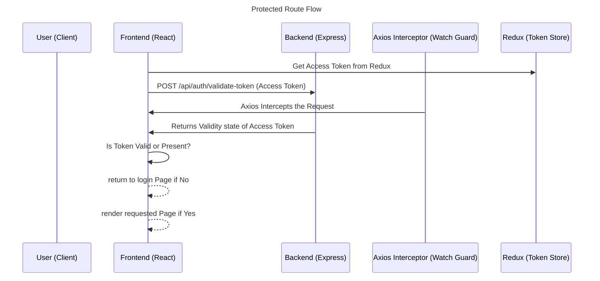

> Part of Kronos -> Developer Productivity Guardian

# Protected Route

<br>

## About

<br>


Protected route serves as a gate keeper for pages that require authorization by working with an axios interceptor and validate-token endpoint.

<br>

## Flow Diagram

<br>




<br>

## Frontend


### Protected Route
<br>

Get Access Token from redux

```tsx
  const reduxToken = useSelector(
    (state: RootState) => state.authenticated.isAuthenticated
  );
```

Send a request to validate-token endpoint through an axios-interceptor

```tsx
   try {
        // Always try calling a backend endpoint to check token validity.using your interceptor ensures that if access token is expired,it will automatically refresh via your interceptor logic.
        await api.post("/api/auth/validate-token");
        // If it succeeds, token is valid
        setAuthorizedState(true);
      } catch {
        // If it fails (refresh also failed), redirect to login
        setAuthorizedState(false);
      } finally {
        setChecking(false);
      }
```

If token is valid or present, render required page

```tsx

  return <>{children}</>;
```