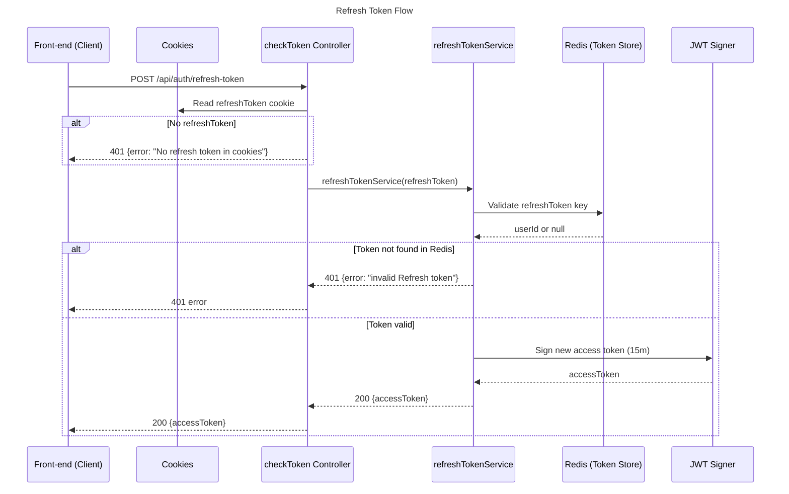

> Part of Kronos -> Developer Productivity Guardian


# Refresh Token System

This section documents how Kronos verifies refresh tokens stored in Redis, issues new access tokens, and responds to the frontend when the old access token has expired.

<br>

## Overview

Kronos uses short-lived access tokens (15 minutes) and long-lived refresh tokens (30 days).

When the frontend detects a 401 (access-token expired), it calls:

```
POST /api/auth/refresh-token

```

The backend then:

1. Reads the refreshToken from cookies.
2. Checks Redis to ensure the token is valid and not expired.
3. Signs a new access token for the user.
4. Sends the new access token back to the client.

<br>

## Flow Diagram



<br>

---

# Backend

## refreshTokenService

Validates refreshToken against Redis, then issues a new access token.

### Steps

- Look up the refreshToken in Redis.
- If Redis returns nothing → token is invalid or expired.
- If it exists → sign a fresh access token.

<br>

### Code

```tsx
import { getRefreshTokenFromRedis } from "../../../core/redisClient.js";
import jwt from "jsonwebtoken";

export async function refreshTokenService(refreshToken) {
  const storedUserId = await getRefreshTokenFromRedis(refreshToken);
  // Checks if redis contains this exact refreshToken → proves it is still valid

  if (!storedUserId) {
    return {
      status: 401,
      error: {
        message: "invalid Refresh token",
      },
    };
  }

  // Sign a new short-lived access token
  const accessToken = jwt.sign(
    { userId: storedUserId },
    process.env.ACCESS_TOKEN_SECRET,
    { expiresIn: "15mins" }
  );

  return {
    status: 200,
    data: {
      message: "User Logged in successfully",
      accessToken: `${accessToken}`,
    },
  };
}

```

<br>

---

## checkToken Controller

Controller responsible for:

- Reading refreshToken from cookies
- Calling `refreshTokenService`
- Returning a new access token if valid
- Returning 401 when invalid

<br>

### Code

```tsx
import { refreshTokenService } from "../services/refreshTokenService.js";

export async function checkToken(req, res) {
  try {
    const refreshToken = req.cookies.refreshToken;

    // No cookie → user cannot be refreshed
    if (!refreshToken) {
      return res.status(401).json({ error: "No refresh token in cookies" });
    }

    // validate refresh-token
    const result = await refreshTokenService(refreshToken);

    const responseBody = {};
    if (result.data?.accessToken) {
      responseBody.accessToken = result.data.accessToken;
    }

    // send response
    if (result.status === 200) {
      return res.status(200).json(responseBody);
    } else if (result.status === 401) {
      return res.status(401).json(result.error);
    }
  } catch (error) {
    return res.json({ error: `${error}` });
  }
}

```

<br>

---

# How It Works

- Refresh token lives in **Redis**, not the DB.
- The refresh token in cookies must exactly match the redis key.
- If redis confirms it → user is still logged in.
- Backend signs a new access token using the stored `userId`.
- The frontend receives the new token and retries the original request.
- If Redis does not have the refresh token → user must log in again.