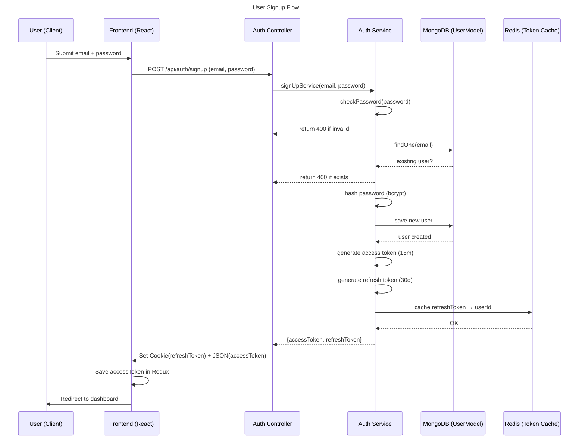

> Part of Kronos -> Developer Productivity Guardian


# Signup

This page explains the entire signupflow for kronos

<br>

## Flow Diagram

<br>

## Backend

<br>

### AuthController
- Get email and password from http request and use them in authService
```javascript   const { email, password } = req.body;
  const result = await signUpService(email, password);
  ```

  <br>

### AuthService
- Using checkPassword utility function check if password is valid
```javascript
    const isPasswordValid = checkPassword(password); //check if password 
    //is invalid and alert user

    if (!isPasswordValid) {
      return {
        status: 400,
        data: {
          error:
            "password must contain at least one special character and no whitespace",
        },
      };
    }//end process if password combination is invalid
```

- If Password is okay, check for duplicates
```javascript
    const existingUser = await userModel.findOne({      userEmail: email }); // catch duplicates
    if (existingUser) {
      return {
        status: 400,
        data: { error: "user already exists" }, 
      };
    }//end process if user already exists
```

- Generate hash for password using utility function
```javascript
    const hashpassword = await genHashPassword(password); //hash using bcrypt
```

- Create new user for mongoDB collection

```js
    const newUser = new userModel({
      userEmail: email,
      userPassword: hashpassword,
    });//create a new user using mongodb model
```

- creating access and refresh token for authorization

```jsx
 const accessToken = jwt.sign(
      { userId: newUser["_id"], roles: newUser["roles"] },
       process.env.ACCESS_TOKEN_SECRET,
      { expiresIn: "15m" }
    ); //access-token for front-ends redux 

    const refreshToken = jwt.sign({ userId: newUser["_id"] },  process.env.REFRESH_TOKEN_SECRET,{
      expiresIn: "30d",
    }); //refresh Token for cookie and redis
```

- Caching refresh Token in redis and saving user

We use the refreshToken as the key so that we can target it later on using refresh cookie

```jsx
    redisClient.set(refreshToken,`refresh:${newUser["_id"]}`, { EX: 60*60*24*30 });
    await newUser.save();
```

- Response for Auth controller

```jsx
return {
      status: 200,
      data: {
        message: "User created successfully",
        accessToken: `${accessToken}`,
        refreshToken: `${refreshToken}`,
      },
    };
```

## Auth Controller

- Set cookie from refresh token passed in

```jsx
  //only return cookies if signUp is successful
  if (result.status == 200)
  {res.cookie("refreshToken", result.data.refreshToken, {
    httpOnly: true, // JS cannot access it
    path: "/",
    secure: false, // only over HTTPS in production
    sameSite: "Lax",
    maxAge: 30 * 24 * 60 * 60 * 1000,
  });}
  
```

Create responseBody containing access token

```jsx
  // Construct the JSON response dynamically based on success/failure
  const responseBody = {
    message: result.data.message,// we expect data.message to always be present
  }
  if (result.data.accessToken){
    responseBody.accessToken = result.data.accessToken
  }
```

Responding to front-end

```jsx
  //return a status code and message
  return res.status(result.status).json(responseBody)
```
<br>
<br>


## Frontend

### AuthForm

Dynamically determine the route we’d be using for fetch request

```tsx
    // dynamically targetting backend endpoint depending on if we're dealing with new or existing user
    const endpoint = isExistingUser
      ? `${baseBackendUrl}api/auth/login`
      : `${baseBackendUrl}api/auth/signup`;
```

Make POST request

```tsx
  // grabbing response from express backend api
    const res = await fetch(endpoint, {
      method: "POST",
      credentials:"include",
      headers: { "Content-Type": "application/json" },
      body: JSON.stringify({ email, password }), //send email and password to backend for processing
    });
```

Grab POST response

```tsx
    // try catch block to hold parsed response
    let data; // data variable to provide jwt token
    try {
      data = await res.json();
      setAuthErrorMsg(data.error)
      console.log("Backend response:", data);
      // if my data from backend is a token grab it
   
      } catch (err) {
      console.error("Error parsing JSON:", err); // handle JSON parsing errors
      return;
    }
```

Grab Access Token, set it to redux state and navigate to protected route

```tsx
//setting access token
           if (data.accessToken) {
        token = data.accessToken;
        //update redux state with token
        dispatch(setAuthenticated(token));
        dispatch(toggleExistingUser());
        navigate("/dashboard", { replace: true }); //dashboard route
  };
```